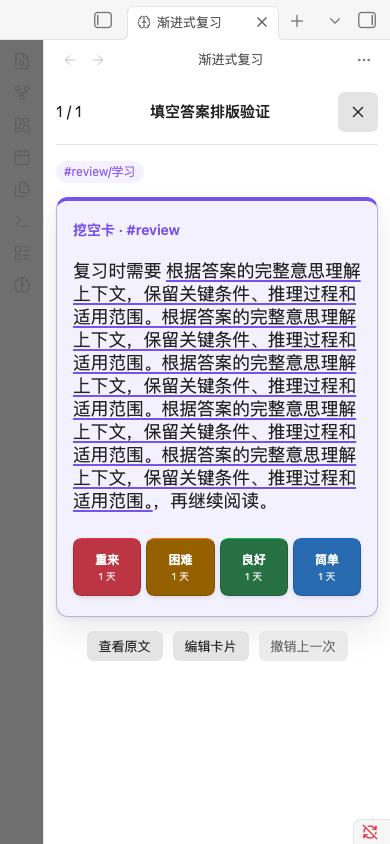
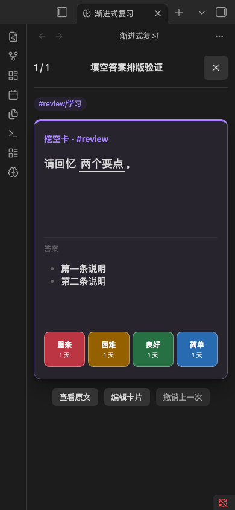

# 1.0.2 验证记录

验证日期：2026-09-09。以 1.0.1 为基线，加入填空答案显示与换行修复。

## 自动检查

- 38 个测试文件、261 项测试通过，包含答案内代码、代码示例排除、同编号答案顺序，以及多行、段落、列表答案的隐藏、显示和已显示状态重绘。
- ESLint 无错误，保留原有 `elapsed_days` 弃用提示；TypeScript、生产构建和发行文件检查通过。
- 使用锁文件安装依赖；发行程序和样式与完成下述原生验证的修复构建逐字节核对，版本元数据更新不改变运行逻辑。

## 原生渲染验证

在 macOS、Obsidian 1.13.7 独立测试库中，通过真实卡片视图和原生 MarkdownRenderer 渲染合成条目。10 类内容、1180/390/320px 三种窗口宽度和明暗主题，共 60 个场景、697 条断言通过，没有捕获页面运行错误。

- 短答案、中文长段落、英文连续长串和长提示均限制在卡片宽度内。
- 点击“显示答案”后显示完整内容，评分按钮位于内容下方；以已显示状态重新绘制视图，结果一致。
- 显式换行、跨段落、列表和同编号多个答案保留各自结构，未出现泄漏的填空分隔标记。
- 粗体、行内代码、链接和补充材料高亮保持对应 Markdown 样式。

原版英文长串曾将约 248px 的正文区撑到约 2894px；修复后所有上述场景的正文与答案区域均无横向溢出。

[断言及布局测量](assets/1.0.2-native-qa.json)。





## 安装包与发布核对

安装包只包含 `main.js`、`manifest.json`、`styles.css`、`LICENSE`、`THIRD_PARTY_NOTICES.txt`、`priority-queue-2.7.0-source.zip`，不包含个人设置、笔记或复习数据。打包脚本逐文件回读 ZIP 并生成 SHA-256 清单。

发布提供完整 ZIP、独立程序附件及 `SHA256SUMS`，上传后重新下载并核对标签、Release 状态与文件哈希。[GitHub Actions](https://github.com/812344707/obsidian-review-center/actions/workflows/ci.yml) 提供同一提交的远端检查记录。

安装包为 402923 字节，SHA-256：

```text
5ce84aeaf57fd21107e0c660d8518bc56595ad2cf0afea81ea9cfd0a6437e9c1
```

[本地发行检查结果](assets/1.0.2-checks.json)。

## 验证边界

390/320px 是桌面窗口模拟。尚未验证真实 iOS、iPadOS、Android、手机软键盘、设备休眠恢复与跨设备并发同步，也未完成 Windows/Linux 原生界面或最低 Obsidian 1.13.0 实机验收。合成条目的视图重绘检查不等同于跨设备会话恢复验收。
