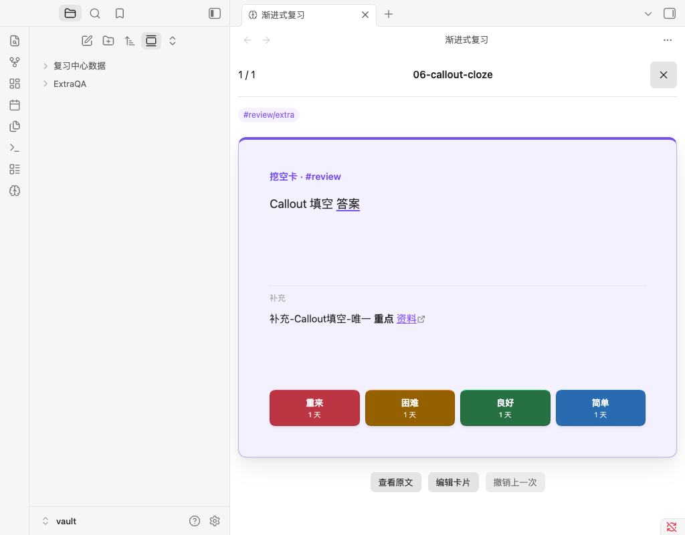

# 1.0.3 验证记录

验证日期：2026-09-09。以已发布的 1.0.2 为基线，只修改 `Extra:` 的解析、答后显示和标准问答模板。

## 自动检查

- 40 个测试文件、279 项测试通过，覆盖六种卡片写法、空补充、多段 Markdown、代码中的字面示例、稳定编号和内容变更处理。
- ESLint 无错误，保留原有 `elapsed_days` 弃用提示；TypeScript、生产构建和发行文件检查通过。
- 没有补充内容的既有问答卡保持原内容哈希；补充变化保留稳定卡片编号、排程和已接受内容，进入待核对状态。

## 原生界面验证

在 macOS 的独立临时 Obsidian 测试库中，真实扫描标准 Basic、正文问答、`[!review]` 问答、标准 Cloze、正文挖空和 `[!review]` 挖空，共 89 条断言通过，没有捕获页面运行错误。

- 六种卡片正面均不显示补充内容和 `Extra:` 字样。
- 点击“显示答案”后，补充内容只出现一次，位于答案与评分按钮之间；`Extra:` 字样仍不显示。
- 补充中的粗体和链接由 Obsidian 原生 Markdown 渲染器正常显示；已显示状态重新绘制后结果一致。
- 补充中的挖空标记没有产生额外卡片。

[原生验证明细](assets/1.0.3-native-qa.json)。



## 安装包与发布核对

安装包只包含 `main.js`、`manifest.json`、`styles.css`、`LICENSE`、`THIRD_PARTY_NOTICES.txt`、`priority-queue-2.7.0-source.zip`，不包含个人设置、笔记或复习数据。打包脚本逐文件回读 ZIP 并生成 SHA-256 清单。

发布提供完整 ZIP、独立程序附件及 `SHA256SUMS`，上传后重新下载并核对标签、Release 状态与文件哈希。[GitHub Actions](https://github.com/812344707/obsidian-review-center/actions/workflows/ci.yml) 提供同一提交的远端检查记录。

安装包为 403545 字节，SHA-256：

```text
ec4a84039b0383fd5f6e8f262c38c8841d6f76c2794fa15a210e6d8003c73bee
```

[本地发行检查结果](assets/1.0.3-checks.json)。

## 验证边界

本次原生界面测试使用合成笔记和桌面 Obsidian；尚未验证真实 iOS、iPadOS、Android、Windows/Linux 界面或跨设备并发同步。发布前的临时测试库与用户日常知识库完全分离。
