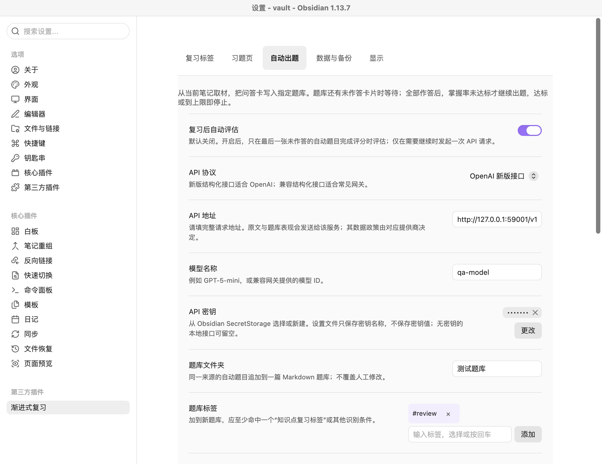
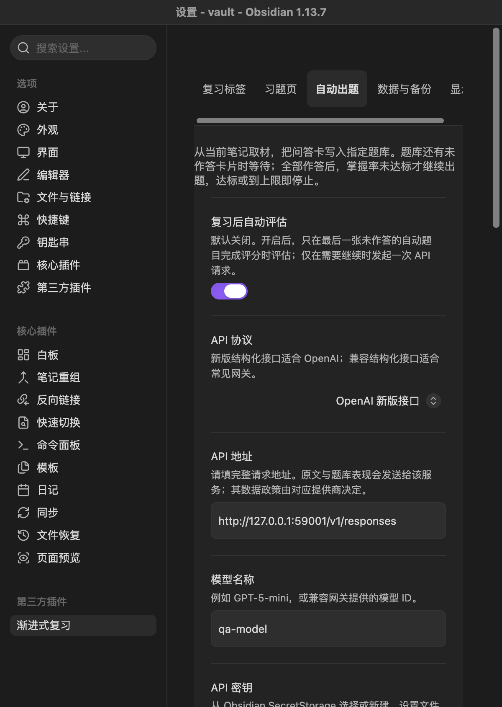

# 自动出题模式验证记录

日期：2026-09-20。环境：macOS、Obsidian 1.13.7、独立临时测试知识库。本次只使用合成医学原文和监听 `127.0.0.1` 的模拟 Responses API，没有读取正式知识库，也没有把原文或密钥发送到外部服务。

## 构建与自动化检查

- 功能分支：`codex/auto-question-mode`。
- 功能实现提交：`b2641b89a07808ca39d256bcc9422c4cf201ec83`。
- `npm run check` 通过：47 个测试文件、307 项测试全部通过；TypeScript、生产构建和 release consistency 检查通过。
- `TZ=America/New_York npm test` 通过：47 个测试文件、307 项测试全部通过。
- 安装到测试库的 `main.js`、`manifest.json`、`styles.css` 与本地构建 SHA-256 一致。

## 真实 Obsidian 流程

### 设置与密钥

- 原生设置窗口显示“自动出题”页签，并包含自动评估、API 协议、API 地址、模型、SecretStorage 密钥、题库文件夹、标签、题量、掌握率、原文上限及自定义提示词。
- 通过 Obsidian 原生 SecretStorage 新建并选择测试密钥；重载插件和完整重启 Obsidian 后仍可读回。
- 插件 `data.json` 只保存密钥名称 `auto-question-qa`，不包含测试密钥值。
- 自动评估、回环 API、模型、题库文件夹、每批 2 题、75% 停止阈值、6 题上限和自定义提示词均能保存并在重载后恢复。

### 生成、等待、追加与停止

1. 从合成原文手动执行“评估并继续”，实际向回环 Responses API 发送一次 POST，请求包含模型 `qa-model`、`store: false`、Authorization 头和原文；随后在 `测试题库/髋关节感染-自动题库.md` 创建首批 2 道题。
2. 题库含未作答卡片时再次手动评估，题库没有变化，也没有发起第二次请求。
3. 在真实复习界面依次将首批两题评为“困难、良好”，掌握率为 50%，插件自动发起第二次请求并追加第 2 批 2 道题。
4. 将第二批两题均评为“良好”后，四题最新评分为 `2, 3, 3, 3`，掌握率达到 75%；自动评估和随后手动复查均没有发起第三次请求。
5. 最终题库含 2 个批次、4 个解析有效的 `[!review]+` 卡片，复习数据保存 4 条评分历史。

### 重载与视觉检查

- 禁用再启用插件后，自动出题设置、SecretStorage 引用、两批四题和四条评分历史保持不变。
- 完整退出并重新启动隔离 Obsidian 进程后，上述状态仍保持，停止闸门仍然生效。
- 设置页在 1100×850 浅色窗口和 Obsidian 原生最小宽度约束下的 600×844 深色窄窗口中均无控件横向溢出。请求 390 px 窗口时，Obsidian 1.13.7 将设置窗口限制为 600 px，因此本记录不把它写成 390 px 验收。
- 页面没有捕获 `error` 或 `unhandledrejection`。

## 验收边界

本次验证证明本地回环 API、Obsidian SecretStorage、题库写入、真实评分驱动的追加/停止逻辑和跨重启持久化可以闭环运行。它不等同于真实第三方模型提供商验收，也未覆盖实体 iOS/Android、Windows/Linux、跨设备同步或外部服务异常。当前版本仍为 1.3.1 开发分支，尚未推送、创建 Release 或部署到正式知识库。
