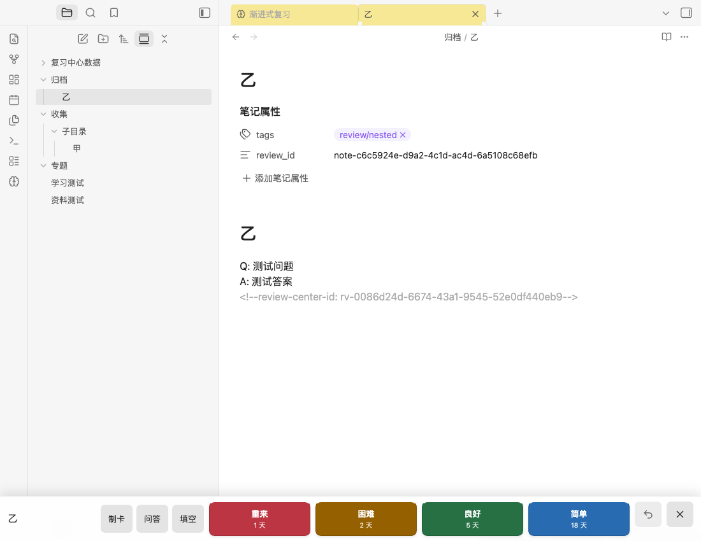

# 进入复习时启用目录自动定位

2026-09-07，基于 0.4.5 的本地开发包，包含此前的选项精简和笔记按天回顾。

## 行为

- 进入复习中心、开始或继续笔记复习时，自动启用 Obsidian 文件列表顶部的“自动显示当前文件”（Auto-reveal active file）。直接进入卡片复习也会启用此开关。
- 开关已开启时不再切换，反复进入不会把它关闭。使用原生开关的保存逻辑，退出复习后保留开启状态。
- 打开复习笔记、切换下一篇时，由原生文件列表展开父文件夹、滚动并高亮当前文件，编辑焦点保留在笔记中。
- 保留原有目录排序、筛选和侧栏展开状态。侧栏收起时不会强行打开；再展开时显示当前笔记位置。
- 文件列表不存在或当前版本不提供此能力时，复习流程继续正常运行。

没有新增插件设置，也没有引入另一套目录树。调研依据为 [Obsidian 文件列表说明](https://obsidian.md/help/plugins/file-explorer)，并在隔离的 Obsidian 1.13.7 中核对原生开关行为。实现对原生文件列表未公开的成员做存在性检查；后续 Obsidian 版本若更改内部接口，需要重新核对兼容性。

## 验证

`npm run check`：31 个测试文件、209 项测试通过，TypeScript 检查与生产构建通过。

独立 Obsidian 1.13.7 测试库中，21 个界面与流程断言通过，没有捕获到未处理运行错误。覆盖：

| 检查 | 结果 |
| --- | --- |
| 首次进入及多次进入复习中心 | 原生按钮开启，重复进入仍保持开启 |
| 直接开始笔记、卡片及继续复习 | 关闭状态都能自动开启 |
| 目录原有排序和筛选 | 保留 |
| 原文打开及跨文件夹切换下一篇 | 自动展开、高亮正确文件，编辑焦点保留 |
| 在 Obsidian 内移动正在复习的笔记 | 原生目录跟随新路径，笔记 ID 和复习进度保留 |
| 侧栏收起后开始复习 | 开关启用，侧栏保持收起；展开后定位正确 |
| 文件列表暂时不可用 | 不阻止进入复习 |
| 原生状态保存及插件重载 | `workspace.json` 保存 `autoReveal: true`；重载保留设置和历史 |

真实流程记录保存在 `.build/auto-reveal-qa/flow-result.json`，交付目录附副本。未实测 iOS／Android 真机。

## 交付

安装包：`release/auto-reveal-2026-09-07/review-center-auto-reveal-2026-09-07.zip`。

关闭插件，将包内 `review-center` 文件夹的程序文件复制到知识库的 `.obsidian/plugins/review-center/`，替换同名文件，然后重新启用。保留原有 `data.json` 和复习数据目录。版本号仍为 0.4.5，以包名和 SHA-256 区分本地开发包。

本次未安装到正式知识库或发布新版本。安装包也包含 [笔记按天回顾与默认参数](note-daily-review-2026-09-07.md)。
