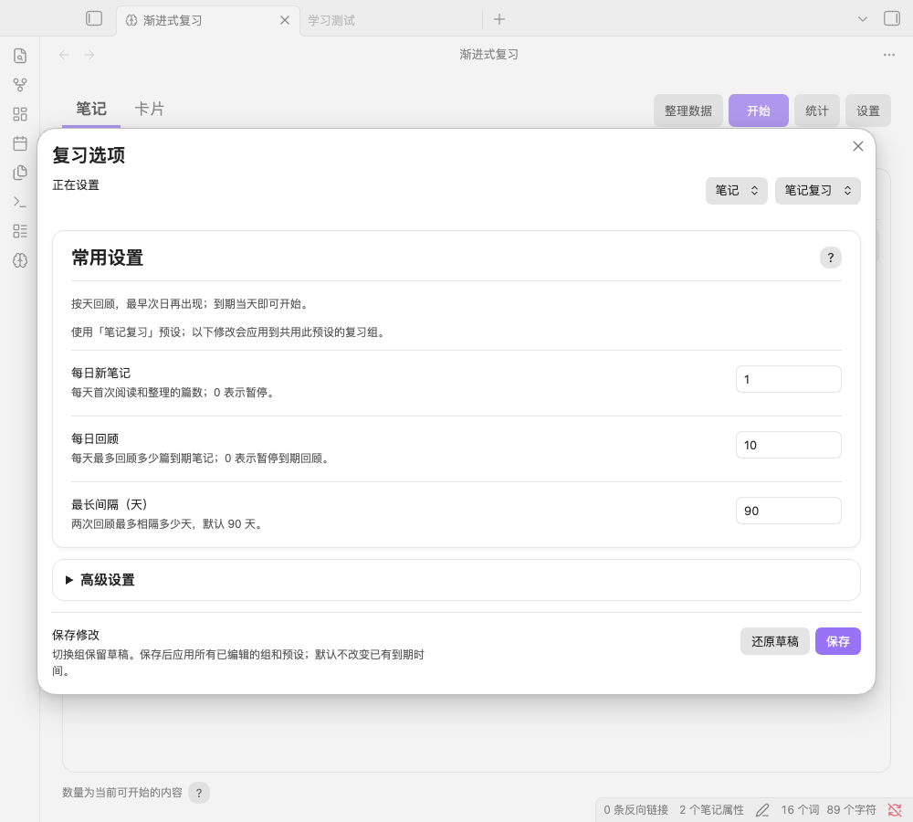
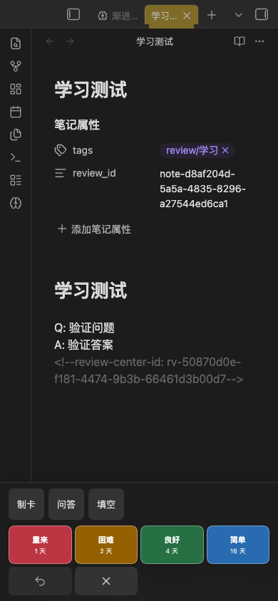

# 笔记按天回顾：默认参数与验证

2026-09-07，基于 0.4.5 的本地开发包，包含此前的参数界面精简。本次实现用户要求的笔记按天复习和默认参数，不增加手动指定日期入口。尚未安装到正式知识库，也未发布新的 GitHub 版本。

## 默认参数

| 参数 | 笔记 | 知识点卡片 |
| --- | --- | --- |
| 每日新内容 | 1 篇 | 10 张 |
| 每日到期回顾 | 10 篇 | 100 张 |
| 目标记忆率 | 85%，放在高级设置 | 90% |
| 最长间隔 | 90 天 | 36500 天 |
| 学习／重学步骤 | 关闭短期步骤，按天安排 | 保留 `1m 10m`／`10m` |

笔记每天先引入 1 篇，另回顾最多 10 篇到期内容，控制整理负担；90 天上限用于定期回访。这些是起始默认值，不是最佳学习效果的保证。已有自定义每日额度、记忆率及其他最长间隔保留。

笔记常用界面显示“每日新笔记、每日回顾、最长间隔（天）”；目标记忆率放入高级设置，笔记不显示分钟学习／重学字段。知识点卡片的常用界面和分钟排程保持原有行为。

## 按天的含义

- 四档评分仍由 FSRS 自动安排，笔记的间隔全部显示为天，正常队列最早次日再次出现。
- 晚上选择“1 天”后，次日零点即可回顾，不必等待满 24 小时。算法的间隔计算也使用当地日历日期；原始评分时间继续保留。
- 队列、首页数量、下次到期提示和统计到期图使用同一日期判断。夏令时的 23／25 小时日期也按日历处理。
- 撤销、复习次数、稳定 ID、知识点进度和历史记录继续保留。主动使用原有额外练习功能仍可提前练习。

升级时，旧版默认的 36500 天笔记上限一次性改为 90 天；其他自定义上限保留。迁移标记保存后，即使主动改回 36500 天，重载也不会再次覆盖。旧分钟笔记的有效到期时间最早为评分次日，无需批量改写源记录和历史。

90 天上限默认从下一次评分起生效；已有远期排程不会因升级批量提前。原有“更改时重新排程”功能继续按其预览和备份流程处理。

## 调研依据

沿用当前依赖 `ts-fsrs 5.4.1`，通过 [`enable_short_term: false`](https://open-spaced-repetition.github.io/ts-fsrs/interfaces/FSRSParameters.html#enable_short_term) 关闭笔记短期步骤，不新增算法切换。借鉴 [Spaced Repetition 的整篇笔记日期队列](https://stephenmwangi.com/obsidian-spaced-repetition/notes/) 将笔记回顾与知识点训练分别呈现。

本地参数优化器继续使用固定的 `fsrs 6.6.2`，笔记训练关闭短期参数，模拟学习／重学步数为 0；重新编译并嵌入 WASM，知识点保留原有训练方式。

## 验证结果

- `npm run check`：31 个测试文件、209 项测试通过，TypeScript 检查和生产构建通过；最后的说明文字精简后再次构建通过。
- `TZ=America/New_York npx vitest run tests/note-daily.test.ts`：14 项专项通过，包含春秋夏令时日期、分钟旧排程、四种学习状态、四档评分、日期到期、统计、撤销及重新排程。
- Node 优化器分别验证笔记与卡片模式：400 条跨日样本的训练、评估、健康检查、七档记忆率模拟通过。浮点边界断言按 Rust `f32` 的实际数值比较。
- 独立 Obsidian 1.13.7 测试库：38 个界面与流程断言通过，无捕获到的未处理运行错误。

| 实际操作 | 结果 |
| --- | --- |
| 切换笔记／卡片，编辑常用与高级参数 | 草稿保留、模式独立、保存成功 |
| 输入 0 天最长间隔 | 阻止保存，已有设置不变 |
| 旧设置加载与再次重载 | 默认上限迁移、自定义间隔保留、迁移只执行一次 |
| 原笔记底部评分、撤销 | 四档均显示天；“重来”排到次日；当天不再次入队；撤销恢复原排程 |
| 设置保存与插件重载 | 两个来源和六条历史保持一致，知识点排程不受笔记评分影响 |
| 实际 Web Worker 优化、模拟、取消和保存 | 按天训练成功，建议率更新高级输入，取消保留草稿；无短期参数的权重可保存 |
| 1000×900 与 390×844 布局 | 常用区无横向溢出；窄屏输入和保存按钮高 44 px；检查了明暗样式及评分条 |

优化器使用的 80 个合成项目只临时注入测试实例的内存，未写入笔记或复习历史。原始验证输出保存在 `.build/note-day-qa/`；交付目录附有流程和布局记录。窄屏为桌面 Obsidian 模拟，未实测 iOS／Android 真机及其软键盘。

## 界面

## 安装包

`release/note-daily-2026-09-07/review-center-note-daily-2026-09-07.zip`。

关闭插件后，将包内 `review-center` 文件夹中的文件复制到知识库的 `.obsidian/plugins/review-center/`，替换对应程序文件，再启用插件。保留原有 `data.json` 和知识库中的复习数据目录。包内不包含测试库、用户设置或复习记录，版本号仍为 0.4.5，以包名日期和附带 SHA-256 区分本地开发包。
