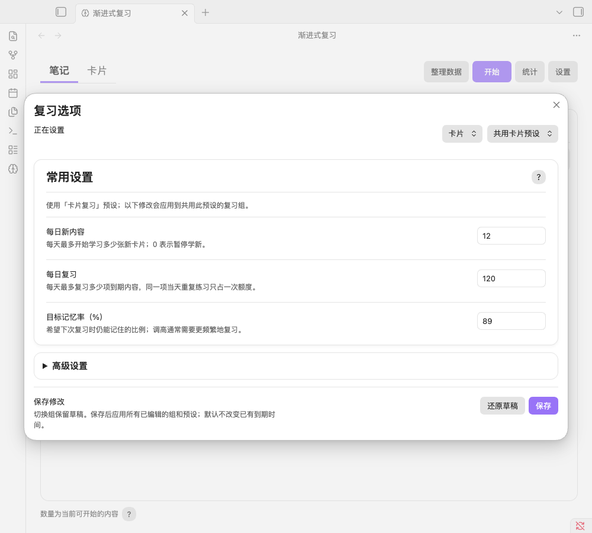

# 复习选项精简与验证

基于 0.4.5 的本地改动。2026-09-07 完成；本轮没有安装到正式知识库或发布 GitHub 新版本。

同日后续已按新的用户要求调整笔记默认参数和常用字段，见 [笔记按天回顾](note-daily-review-2026-09-07.md)。本文保留最初参数界面精简阶段的设计与验证记录。

## 调研与取舍

开发前核对了 [Decks 的官方设置说明](https://github.com/dscherdi/decks#settings)：它通过预设管理日限额、目标记忆率和其他参数。本次借鉴参数分层的做法，复用本项目已有预设与保存路径。

默认显示三个常用参数：每日新内容、每日复习、目标记忆率。编辑的是当前使用的预设，多个组可以继续共用少数预设；需要区别时，在高级设置中选择、复制预设或填写单独设置。没有新增算法、预设迁移或参数默认值变更。

“高级设置”默认折叠，集中容纳预设管理及继承、当前组／分支单独设置、仅限今日额度、学习步长、排序、关联卡搁置和 FSRS 优化。原有覆盖值保留，常用区显示当前行的生效数值与直达入口。

## 使用与行为

- 从主页复习组或标签行的齿轮进入“选项”。常用区修改共享预设前，会显示当前预设名称及影响范围说明。
- 修改只进入草稿；切换笔记／卡片、复习组、额度页签及展开／折叠不会丢失草稿。保存后统一应用；还原草稿撤回尚未保存的修改。
- 单独额度留空恢复预设值，0 是有效的停止额度；今日额度优先，次日失效。单独目标记忆率留空恢复父级或预设。
- 复制预设后可单独修改；子标签可以切回继承父级。高级区在切换额度页签和复制预设后保持展开。
- 原有“更改时重新排程”选项及其确认流程保留，默认关闭。

## 验证证据

`npm run check` 通过：30 个测试文件、193 项测试、TypeScript 检查和生产构建。已有测试覆盖按节点的限额、今日覆盖到期、预设继承与排程等行为。

另外启动了独立 Obsidian 1.13.7 实例，使用两个合成来源笔记、共享预设的两个卡片组、独立笔记组和子标签覆盖；先实际评分一次，再操作选项界面。26 项行为检查全部通过，包含：

| 要求 | 实测结果 |
| --- | --- |
| 常用区突出三个参数，其他控制收进高级入口 | 常用区正好三个可见输入；高级区默认折叠 |
| 共享预设与各组覆盖分离 | 共享预设草稿可跨组查看；另一组不继承当前组的独立额度 |
| 笔记／卡片与草稿切换 | 数值独立；切换后草稿保留，统一保存成功 |
| 当前范围／今日覆盖 | 3 的常规额度与今日 0 分别写入原字段；生效提示正确 |
| 清除、复制、恢复继承、还原草稿 | 清除后恢复继承；复制只产生一份新预设；切回父级及还原草稿正确 |
| 无效数值与保存按钮 | 100% 目标记忆率阻止保存，原设置不变，按钮恢复可用 |
| 磁盘保存与重载 | 磁盘设置与内存一致；重新加载插件后设置保留，高级入口重新默认折叠 |
| 排程与历史保护 | 全过程两个来源记录与五条历史的序列化内容保持一致，包括已有评分 |
| 布局 | 1000 × 900 桌面和 390 × 844 窄屏没有横向溢出；常用输入在窄屏高 44 px；检查明暗样式 |

真实行为检查结果保存在 `.build/options-qa/flow-result.json`，操作脚本位于同目录。构建包三文件与隔离实例中实际加载的文件及 ZIP 内文件逐字节一致，验证记录与 SHA-256 位于 `release/options-simplification-2026-09-07/`。

窄屏检查使用桌面 Obsidian 窗口模拟尺寸。实体 iOS／Android 和真实软键盘尚未验收。

## 界面

