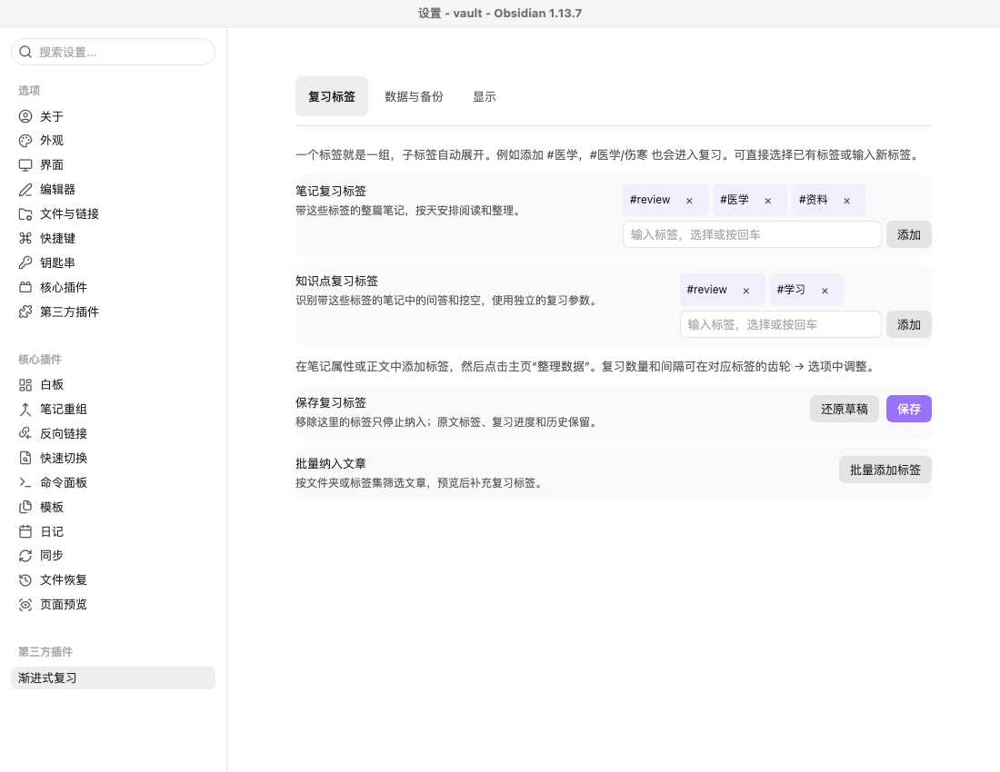
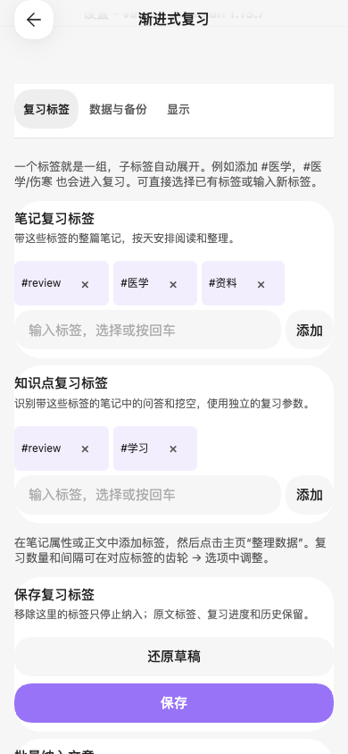

# 自定义标签分组

2026-09-07，基于 0.4.5 的本地开发更新，包含此前的参数精简、笔记按天回顾和自动启用 Auto-reveal。

## 使用方式

在“设置 → 渐进式复习 → 复习标签”中，分别填写笔记和知识点使用的标签。

| 配置示例 | 复习内容 | 首页显示 |
| --- | --- | --- |
| 笔记标签 `#医学` | 带 `#医学` 或 `#医学/伤寒` 等子标签的整篇笔记 | `#医学`，下级自动展开“伤寒”等分支 |
| 知识点标签 `#学习` | 带 `#学习` 或其子标签的笔记中的问答、挖空 | `#学习`，下级按标签层级展开 |

可选择已有标签，也可直接输入新标签；支持联想、回车添加、点击添加和逐个移除。输入后直接保存也会接收有效标签。切换设置分类保留未完成的输入和草稿，点击“还原草稿”放弃本次修改。

添加配置后，在原文属性或正文打上相应标签，再到首页点击“整理数据”。只在设置中添加标签不会自动修改原文；需要批量打标签时，可使用原有的“批量添加标签”预览功能。

一个自定义标签对应一个组。父标签包括子标签，不区分大小写，`#医学` 不会匹配 `#医学基础`。同一内容命中多个根标签时，具体子标签优先，同层级保留原有顺序；每个复习项仍只有一份进度。两类参数独立，笔记继续按天回顾。

设置由五个分类收为“复习标签／数据与备份／显示”三个分类。日常不再需要建组、给组起名、排序、配置文件夹或条件组合。参数继续在首页对应标签的齿轮 → 选项中设置。

## 调研依据

- [Spaced Repetition：笔记复习](https://stephenmwangi.com/obsidian-spaced-repetition/notes/)：通过复习标签纳入文章，允许修改默认标签和配置多个笔记复习组。
- [Spaced Repetition：标签与分层牌组](https://stephenmwangi.com/obsidian-spaced-repetition/flashcards/decks/)：在设置中指定标签，通过嵌套标签形成子组。
- [Obsidian：标签](https://obsidian.md/help/tags)：标签可放在正文或属性中，斜杠表示层级，父标签可匹配子标签。

本次借鉴标签入口与层级组织方式，复用项目现有标签联想、匹配、树形主页和排程数据；FSRS、正文制卡规则和笔记级标签归属沿用现有实现。

## 兼容已有配置

原来一个标签且包含子标签的组，可以直接显示为标签名，保留原来的组 ID、参数预设、节点覆盖和当天已用额度。

文件夹、精确标签、排除条件、多标签组合等旧组无法无损猜测成一个标签，因此继续生效，并集中在默认折叠的“原有分组”中。可选择一个标签并点击“改用标签”，保存后以该标签及子标签替代原范围，同时保留原组 ID 和参数。转换不会给原文补标签，也不重置已有排程和评分历史。

从设置移除一个标签只删除对应范围配置；原文的实际标签、复习进度和历史保留，重新纳入后沿用原来的复习项。删除后再添加会创建新的组配置，原组的自定义参数需要重新设置。

## 验证

`npm run check`：33 个测试文件、217 项测试、TypeScript 检查及生产构建通过。

实际流程在独立 Obsidian 1.13.7 测试库中执行，39 项界面与流程检查通过，没有捕获到未处理运行错误。验证记录见交付目录的 `flow-result.json`。覆盖标签联想与添加、切换草稿、保存与错误恢复、重载、父子标签边界、独立笔记与知识点范围，以及移除／重新纳入／旧条件转换后的真实排程和历史保留。

实际点击标签后开始复习时，发现并修复了首页按钮使用旧选择的问题。现在点击或键盘选择其他组、子标签后，“开始”读取最新选择；笔记和卡片两种模式都有对应回归测试。

桌面保持标签与控件同行，窄屏改为上下排列；两种宽度没有横向溢出，手机布局的标签输入、添加和移除按钮达到 44px，保存可滚动到达。明暗主题均已查看实际截图。窄屏检查为桌面 Obsidian 的 390px 手机布局模拟，尚未实测 iOS／Android 真机或软键盘。

## 安装

本地安装包：`release/tag-groups-2026-09-07/review-center-tag-groups-2026-09-07.zip`。

关闭插件，把 ZIP 中 `review-center` 文件夹的程序文件复制到知识库的 `.obsidian/plugins/review-center/`，替换同名文件，再重新启用插件。保留原来的 `data.json` 和复习数据目录。版本号仍为 0.4.5，用包名与 SHA-256 区分本地开发包。

本次未安装到正式知识库、提交代码或发布 GitHub 版本。
